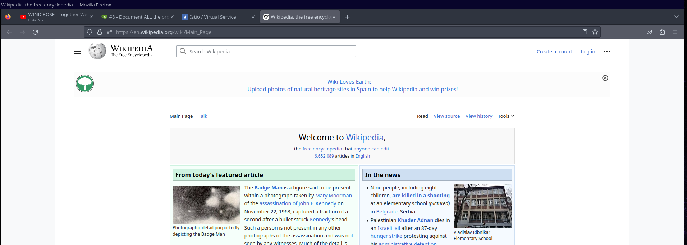
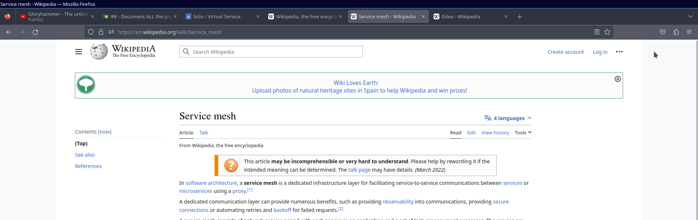

# Description

Based on the [previous example](../../01-Getting_Started/01-hello_world_1_service_1_deployment), we create multiple rules in the [VirtualService](#virtualservice) that will make usage of the `redirect` field to modify the request received and redirect the incoming request towards a new destination.

This example configures:

    Istio resources:
    - 1 Gateway
    - 1 Virtual Service

# Based on

- [01-hello_world_1_service_1_deployment](../../01-Getting_Started/01-hello_world_1_service_1_deployment)

# Configuration

## Gateway

Deploys an Istio gateway that's listening to the port `80` for `HTTP` traffic.

It doesn't filter for any specific host.

The `selector` field is used to "choose" which Istio Load Balancers will have this gateway assigned to.

The Istio `default` profile creates a Load Balancer in the namespace `istio-system` that has the label `istio: ingressgateway` set, allowing us to target that specific Load Balancer and assign this gateway resource to it.

```yaml
apiVersion: networking.istio.io/v1alpha3
kind: Gateway
metadata:
  name: helloworld-gateway
spec:
  selector:
    istio: ingressgateway # use istio default controller
  servers:
    - port:
        number: 80
        name: http
        protocol: HTTP
      hosts:
        - "*"
```

## VirtualService

The configuration set, targets the [gateway created](#gateway) as well of not limiting the traffic to any specific host.

We configure 3 HTTP rules.

- to_https

A practical example regarding modifying protocol used from the incoming traffic request.

It will set the protocol used to `HTTPS`.

> **Note:**\
> Bear in mind that this example is not planned to be used `as it is` on production environments as other configurations should be applied, as an example you should target a specific source port.

- wikipedia

We are using the regex query `/wiki/?` to match the URL path, this rule allows us to target both `/wiki` and `/wiki/`.

On this example we will redirect the traffic that accesses to this rule towards the Wikipedia page, as well the protocol will be modified and set to `HTTPS`.

- wikipedia_search

Very similar to the previous rule, we will match the traffic that, as a prefix of the URl used, as long it starts by `/wiki/`.

More information about the behavior of ties rule will be seen in the [Walkthrough](#walkthrough) section. 

```yaml
apiVersion: networking.istio.io/v1alpha3
kind: VirtualService
metadata:
  name: helloworld-vs
spec:
  hosts:
    - "*"
  gateways:
    - helloworld-gateway
  http:
    - name: to_https
      match:
        - uri:
            exact: /https
      redirect:
        scheme: "https"

    - name: wikipedia
      match:
        - uri:
            regex: "/wiki/?"
      redirect:
        uri: "/"
        scheme: "https"
        authority: "en.wikipedia.org"

    - name: wikipedia_search
      match:
        - uri:
            prefix: "/wiki/"
      redirect:
        scheme: "https"
        authority: "en.wikipedia.org"
```

# Walkthrough

## Deploy resources

Deploy the resources.

```shell
kubectl apply -f ./
```
```text 
gateway.networking.istio.io/helloworld-gateway created
virtualservice.networking.istio.io/helloworld-vs created
```

## Test the rules

### Get LB IP

To perform the desired tests, we will need to obtain the IP Istio Load Balancer that we selected in the [Gateway section](#gateway).

On my environment, the IP is the `192.168.1.50`.

```shell
kubectl get svc -l istio=ingressgateway -A
```
```text
NAME                   TYPE           CLUSTER-IP     EXTERNAL-IP    PORT(S)                                      AGE
istio-ingressgateway   LoadBalancer   10.97.47.216   192.168.1.50   15021:31316/TCP,80:32012/TCP,443:32486/TCP   39h
```

### to_https

We are receiving the status code `301` as the request is being modified.

By default `curl` won't follow the redirects. 

```shell
curl 192.168.1.50/https -I
```
```text
HTTP/1.1 301 Moved Permanently
location: https://192.168.1.50/https
date: Fri, 05 May 2023 00:15:41 GMT
server: istio-envoy
transfer-encoding: chunked
```
 
The flag `-L` can be used to allow `curl` to follow redirects, as well of `-v` to increase the verbosity to review the behavior.

From the output received, we can see how the request initially points towards the port `80`.

After receiving the status code `301`, we can see the following line `Clear auth, redirects to port from 80 to 443`, stating that there was a redirect that changed the destination port, from `80`, to `443`.

As well, there is the line `Issue another request to this URL: 'https://192.168.1.50/https'`, which confirms that the protocol used, which previously was using `HTTP`, now is using `HTTPS`.

This proves that the configuration set is currently being applied and works as intended.

```shell
curl 192.168.1.50/https -L -v
```

```text
*   Trying 192.168.1.50:80...
* Connected to 192.168.1.50 (192.168.1.50) port 80 (#0)
> GET /https HTTP/1.1
> Host: 192.168.1.50
> User-Agent: curl/8.0.1
> Accept: */*
> 
< HTTP/1.1 301 Moved Permanently
< location: https://192.168.1.50/https
< date: Fri, 05 May 2023 00:17:12 GMT
< server: istio-envoy
< content-length: 0
< 
* Connection #0 to host 192.168.1.50 left intact
* Clear auth, redirects to port from 80 to 443
* Issue another request to this URL: 'https://192.168.1.50/https'
*   Trying 192.168.1.50:443...
* connect to 192.168.1.50 port 443 failed: Connection refused
* Failed to connect to 192.168.1.50 port 443 after 0 ms: Couldn't connect to server
* Closing connection 1
curl: (7) Failed to connect to 192.168.1.50 port 443 after 0 ms: Couldn't connect to server
```

### /wiki/

On this example I will be using the Firefox browser to access the destination path `/wiki/`.  

Which on accessing the path, it modified the request and forwarded the traffic towards the path `https://en.wikipedia.org/wiki`.

After accessing such destination, Wikipedia will forward you to the path `/wiki/Main_Page`, as we didn't target any specific element from the wiki.

```shell
firefox 192.168.1.50/wiki/
```


### /wiki/*

On this example I will be using the Firefox browser to access the destination path `/wiki/Istio` and `/wiki/Gitea`.

This will forward us towards the pertinent wiki service, as meanwhile the domain is modified, the path remains the same, allowing us to match the right destination paths.

```shell
firefox 192.168.1.50/wiki/Service_mesh
```



```shell
firefox 192.168.1.50/wiki/Gitea
```


## Cleanup

Finally, a cleanup from the resources deployed.

```shell
kubectl delete -f ./
```
```text
gateway.networking.istio.io "helloworld-gateway" deleted
virtualservice.networking.istio.io "helloworld-vs" deleted
```

# Links of interest

- https://istio.io/latest/docs/reference/config/networking/virtual-service/#HTTPRedirect


# Continues from

- 01-hello_world_1_service_1_deployment


https://istio.io/latest/docs/reference/config/networking/virtual-service/#HTTPRedirect

## The idea is that this rewrite is handled "externally" by the client, not by Istio.


## Practical examples


### HTTP to HTTPS redirect.

The following Virtual Service configuration will redirect all the incoming traffic from the gateway `my-gateway` that uses the http protocol, to the https protocol.

In this example, it would forward all the `http` traffic without taking into account which port is used. 

```
apiVersion: networking.istio.io/v1alpha3
kind: VirtualService
metadata:
  name: to-https-vs
spec:
  hosts:
    - "*"
  gateways:
    - my-gateway
  http:
  - match:
    - name: to_https
      match:
        scheme: http
      redirect:
        scheme: https
```

### Migrated from a domain

The following will update the requests coming "to" the domain `old.domain.com` and rewrite the URL to use the "new" `new.domain.com`

```yaml
apiVersion: networking.istio.io/v1alpha3
kind: VirtualService
metadata:
  name: update-domain-vs
spec:
  hosts:
    - "old.domain.com"
  gateways:
    - helloworld-gateway
  http:
    - name: forward-to-new-domain
      redirect:
        authority: "new.domain.com"
```