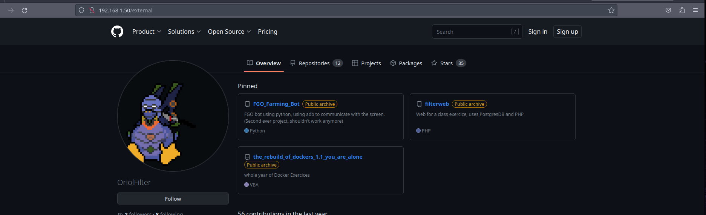

# Description

This example configures an  `ServiceEntry` service pointing to a URL external to our `Istio Service Mesh`.

The main difference with the previous example, is that on this example the resource selected requires `HTTPS` communication.

The page used as a destination is my own [GitHub page](https://github.com/).

# Based on

- [05-hello_world_1_Service_Entry](../05-hello_world_1_Service_Entry)

# Configuration

## ServiceEntry

This `ServiceEntry` resource, defines as a destination the URL `github.com`.

Note that location is set to `MESH_EXTERNAL` and that the resolution is set to `DNS`, this means that the resource is external to ou `Istio Service Mesh`, and the URL will be resolved through `DNS`

This resource listens for the port `8443`, and will connect to its destination with the port `443`, intending to handle `HTTPS` protocol traffic. 

Bear in mind that when Istio is communicating with resources externals to the mesh, `mTLS` is disabled.

Also, policy enforcement is performed in the client side instead of the server side.

> **Note:**/
> For more information regarding the `resolution` field or the `location` field, refer to the following official Istio documentations:
> [ServiceEntry.Location](https://istio.io/latest/docs/reference/config/networking/service-entry/#ServiceEntry-Location)
> [ServiceEntry.Resolution](https://istio.io/latest/docs/reference/config/networking/service-entry/#ServiceEntry-Resolution)

```yaml
apiVersion: networking.istio.io/v1alpha3
kind: ServiceEntry
metadata:
  name: external-github-service
spec:
  hosts:
    - github.com
  ports:
    - number: 8443
      name: https
      protocol: HTTPS
      targetPort: 443
  resolution: DNS
  location: MESH_EXTERNAL
```

## Gateway

Listens for `HTTP` traffic at the port `80` without limiting to any host.

```yaml
apiVersion: networking.istio.io/v1alpha3
kind: Gateway
metadata:
  name: helloworld-gateway
spec:
  selector:
    istio: ingressgateway # use istio default controller
  servers:
    - port:
        number: 80
        name: http
        protocol: HTTP
      hosts:
        - "*"
```


## VirtualService

The path `/external` will forward the request towards the destination URL `github.com`, and path `/OriolFilter`.


Highlight that the destination is `github.com`, which is the same as the contents set on the field `host` from the [ServiceEntry resource configured above](#serviceentry).

As seen [in the previous example, where the host that didn't have the `HOST` header wasn't able to receive a response by the destination](../05-hello_world_1_Service_Entry/#external-noh), we configured the `HOST` header to match the URL from the external service.

```yaml
apiVersion: networking.istio.io/v1alpha3
kind: VirtualService
metadata:
  name: helloworld-vs
spec:
  hosts:
    - "*"
  gateways:
    - helloworld-gateway
  http:
    - name: https-external-service
      timeout: 3s
      match:
        - uri:
            exact: "/external"
      route:
        - destination:
            host: "github.com"
            port:
              number: 8443
      rewrite:
        uri: "/OriolFilter/"
      headers:
        request:
          set:
            HOST: "github.com"
```

## DestinationRule

As seen in the example [02-Traffic_management/09-HTTPS-backend](../../02-Traffic_management/09-HTTPS-backend), where we configure Istio to use an `HTTPS` backend, the same configuration is applied on this case (yes, I am aware that a `ServiceEntry` is also a backend).

For such, we deploy a `DestinationRule` setting to expect to terminate the TLS traffic, for the traffic with resource destination `github.com`, and port `8443`, which matches the settings set in our [ServiceEntry](#serviceentry) deployed.

```yaml
apiVersion: networking.istio.io/v1alpha3
kind: DestinationRule
metadata:
  name: github.com
  namespace: default
spec:
  host: github.com
  trafficPolicy:
    portLevelSettings:
      - port:
          number: 8443
        tls:
          mode: SIMPLE
```

# Walkthrough

## Deploy the resources

```shell
kubectl apply -f ./
```
```text
serviceentry.networking.istio.io/external-github-service created
gateway.networking.istio.io/helloworld-gateway created
virtualservice.networking.istio.io/helloworld-vs created
destinationrule.networking.istio.io/github.com created
```

## Test the service

### Get LB IP

```shell
$ kubectl get svc -l istio=ingressgateway -A
```
```text
NAME                   TYPE           CLUSTER-IP     EXTERNAL-IP    PORT(S)                                      AGE
istio-ingressgateway   LoadBalancer   10.97.47.216   192.168.1.50   15021:31316/TCP,80:32012/TCP,443:32486/TCP   39h
```

### /external

We can visualize the page contents without issues, nothing to highlight.

```shell
curl 192.168.1.50/external
```
```text
...
I mean, we can use curl but it's certainly quite an ugly output, it works tho.
...
```

As performing the test through `curl` is ugly, here is a screenshot of the setting working correctly.



## Cleanup

```shell
kubectl delete -f ./
```
```text
serviceentry.networking.istio.io "external-github-service" deleted
gateway.networking.istio.io "helloworld-gateway" deleted
virtualservice.networking.istio.io "helloworld-vs" deleted
destinationrule.networking.istio.io "github.com" deleted
```

# Links of interest:

- https://istio.io/latest/docs/reference/config/networking/service-entry/#ServiceEntry-Location