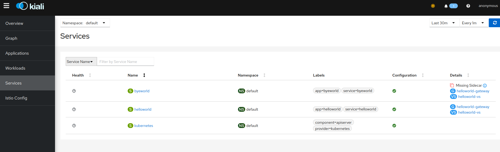

# Continues from

- [01-hello_world_1_service_1_deployment](../../01-Simple/01-hello_world_1_service_1_deployment)

## Description

Nowadays, by default, Istio will have mTLS automatically enabled, allowing the Istio Sidecars to **automatically** negotiate the TLS traffic between them.encrypted.

More information about that topic in the [following documentation](https://istio.io/latest/docs/tasks/security/authentication/authn-policy/#auto-mutual-tls).

To avoid this behavior, the pod requires to not have an Istio Sidecar set to that pod, for that reason on this example we set up 2 deployments, 1 with a sidecar, and a second without a sidecar.

From the Kiali dashboard we will review the mTLS label displayed

> **Note:**\
> If the PeerAuthentication is deployed in the `istio-system` namespace, it will affect all the namespaces in the cluster.

# Changelog


# Walkthrough

## Deploy the resources

```shell
kubectl apply -f ./
````

```txt
peerauthentication.security.istio.io/default-mtls created
service/helloworld created
deployment.apps/helloworld-nginx created
service/byeworld created
deployment.apps/byeworld-nginx created
gateway.networking.istio.io/helloworld-gateway created
virtualservice.networking.istio.io/helloworld-vs created
```

## Install telemetry addons

[Source Folder](https://github.com/istio/istio/tree/master/samples/addons)

```shell
kubectl apply -f https://raw.githubusercontent.com/istio/istio/master/samples/addons/grafana.yaml && \
kubectl apply -f https://raw.githubusercontent.com/istio/istio/master/samples/addons/kiali.yaml && \
kubectl apply -f https://raw.githubusercontent.com/istio/istio/master/samples/addons/prometheus.yaml && \
kubectl apply -f https://raw.githubusercontent.com/istio/istio/master/samples/addons/prometheus.yaml
```

## Wait for deployments to be ready

```shell
kubectl get pods -A -w
```

## Kiali

## Access the Kiali dashboard

The following command will tunnel from this device, towards the Kiali dashboard running, automatically accessing through the default browser.

```shell
istioctl dashboard kiali
```

## Display services menu



> **Highlight:**\
> On the column located at the right, we can notice a note saying `Missing Sidecar`

> **Note:**\
> If there are no resources being displayed, at the top left, select the corresponding namespaces where the resources are located.
> On my case, it's the `default` namespace.

### Byeworld

On the service `byeworld` (reminder that it's pods had the Istio sidecar injection disabled), it displays the message `No mTLS`, meaning that mTLS (Mutual TLS between Istio sidecards) is not available.


### Helloworld

On the service `helloworld`, it displays the message `mTLS`


## Test resources
### Curl / LB requests / requests from external traffic

#### Get LB IP

```shell
kubectl get svc istio-ingressgateway -n istio-system 
```
```txt
NAME                   TYPE           CLUSTER-IP     EXTERNAL-IP    PORT(S)                                      AGE
istio-ingressgateway   LoadBalancer   10.97.47.216   192.168.1.50   15021:31316/TCP,80:32012/TCP,443:32486/TCP   39h
```

#### helloworld

The service works as intended as we can reach the `helloworld` service.

```shell
curl 192.168.1.50/helloworld -s | grep "<title>.*</title>"
```
```txt
<title>Welcome to nginx!</title>
```

#### byeworld

The `byeworld` service also seems to work, even tho the deployment has no sidecar enabled, and for such the `PeerAuthentication` rule is not being maintained. \
Yet, as there is no sidecar, this rule is not applied, and for such the traffic is allowed towards the service and pod.

```shell
curl 192.168.1.50/byeworld -s | grep "<title>.*</title>"
```
```txt
<title>Welcome to nginx!</title>
```

### Connectivity between the deployments

#### helloworld towards byeworld

It works.

```shell
kubectl exec -i -t "$(kubectl get pod -l app=helloworld | tail -n 1 | awk '{print $1}')" -- curl http://byeworld.default.svc.cluster.local:9090 | grep "<title>.*</title>"
```
```txt
<title>Welcome to nginx!</title>
```

#### byeworld towards helloworld

It fails.

Currently, the rule from `PeerAuthentication` that requires the traffic to use mTLS, is currently being applied by the Istio sidecar from the `helloworld` pod.

As `byeworld` pods don't have the Istio sidecar enabled, the mTLS traffic is not being managed, and for such, it fails to obvey the rule set by the `PeerAuthentication` configuration set, resulted on this issue.

```shell
kubectl exec -i -t "$(kubectl get pod -l app=byeworld | tail -n 1 | awk '{print $1}')" -- curl http://helloworld.default.svc.cluster.local:8080
```
```txt
curl: (56) Recv failure: Connection reset by peer
command terminated with exit code 56
```

## Delete the PeerAuthentication configuration set


```shell
kubectl delete peerauthentications.security.istio.io default-mtls
```

### connectivity between byeworld towards helloworld

As the rule is no longer being set, and for such not being applied, the traffic from `byeworld` is able to reach the service `helloworld` without having the need to using mTLS.

```shell
kubectl exec -i -t "$(kubectl get pod -l app=byeworld | tail -n 1 | awk '{print $1}')" -- curl http://helloworld.default.svc.cluster.local:8080 | grep "<title>.*</title>"
```
```txt
<title>Welcome to nginx!</title>
```

# Links of interest

- https://istio.io/latest/docs/concepts/security/#authentication-policies

- https://istio.io/latest/docs/concepts/security/#mutual-tls-authentication

- https://istio.io/latest/docs/tasks/security/authentication/mtls-migration/
