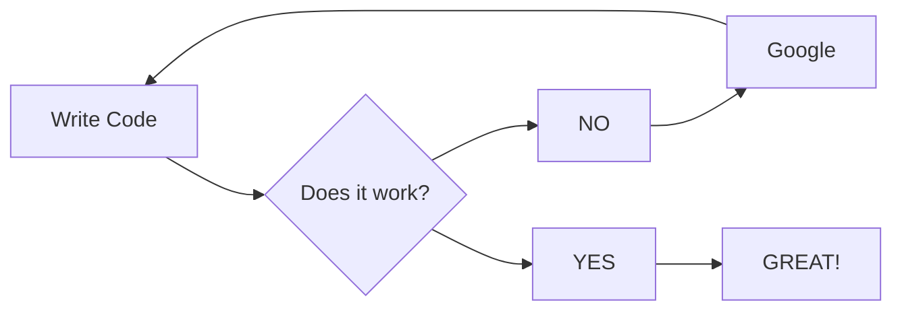

https://plantuml.com/
https://blog.jetbrains.com/dotnet/2020/10/06/create-uml-diagrams-using-plantuml/

```puml
Bob->Alice : Hello!
```

https://mermaid.js.org/#/




> NOTE:\
> Gitea has support for mermaid.\
> Doesn't have support for puml.\
> (obv talking about default behavior)