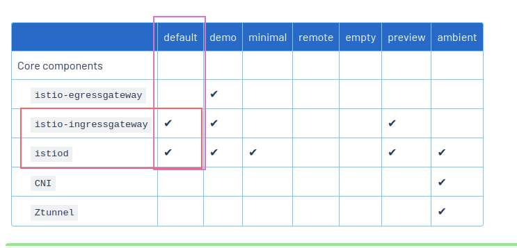

# Description

Installing the [default profile](https://istio.io/latest/docs/setup/additional-setup/config-profiles/#deployment-profiles) of Istio through Helm charts.

This implies installing:

- [Istio-Base](https://artifacthub.io/packages/helm/istio-official/base) (contains the CRD and cluster resources)
- [IstioD](https://artifacthub.io/packages/helm/istio-official/istiod) (the Istio controller)
- [Istio-Gateway](https://artifacthub.io/packages/helm/istio-official/gateway) (deploys an Istio gateway, it can be used both as Ingress or Egress).



## Istio Base

> This chart installs resources shared by all Istio revisions. This includes Istio CRDs.

### Values

```shell
helm show values istio/base
```

```text
# "_internal_defaults_do_not_set" is a workaround for Helm limitations. Users should NOT set "._internal_defaults_do_not_set" explicitly, but rather directly set the fields internally.
# For instance, instead of `--set _internal_defaults_do_not_set.foo=bar``, just set `--set foo=bar`.
_internal_defaults_do_not_set:
  global:

    # ImagePullSecrets for control plane ServiceAccount, list of secrets in the same namespace
    # to use for pulling any images in pods that reference this ServiceAccount.
    # Must be set for any cluster configured with private docker registry.
    imagePullSecrets: []

    # Used to locate istiod.
    istioNamespace: istio-system
  base:
    # A list of CRDs to exclude. Requires `enableCRDTemplates` to be true.
    # Example: `excludedCRDs: ["envoyfilters.networking.istio.io"]`.
    # Note: when installing with `istioctl`, `enableIstioConfigCRDs=false` must also be set.
    excludedCRDs: []
    # Helm (as of V3) does not support upgrading CRDs, because it is not universally
    # safe for them to support this.
    # Istio as a project enforces certain backwards-compat guarantees that allow us
    # to safely upgrade CRDs in spite of this, so we default to self-managing CRDs
    # as standard K8S resources in Helm, and disable Helm's CRD management. See also:
    # https://helm.sh/docs/chart_best_practices/custom_resource_definitions/#method-2-separate-charts
    enableCRDTemplates: true

    # Validation webhook configuration url
    # For example: https://$remotePilotAddress:15017/validate
    validationURL: ""
    # Validation webhook caBundle value. Useful when running pilot with a well known cert
    validationCABundle: ""

    # For istioctl usage to disable istio config crds in base
    enableIstioConfigCRDs: true

  defaultRevision: "default"
  experimental:
    stableValidationPolicy: false
```

### Install helm chart 

When installing by default the revision is "default", so we don't need to specify it.

```shell
helm install istio-base istio/base --version="1.26.2" -n istio-system
```

```text
NAME: istio-base
LAST DEPLOYED: Sat Jul 19 17:34:47 2025
NAMESPACE: istio-system
STATUS: deployed
REVISION: 1
TEST SUITE: None
NOTES:
Istio base successfully installed!

To learn more about the release, try:
  $ helm status istio-base -n istio-system
  $ helm get all istio-base -n istio-system
```

### Check installed

```shell
kubectl get crd -A | grep istio
```

```text
authorizationpolicies.security.istio.io    2025-07-19T15:34:48Z
destinationrules.networking.istio.io       2025-07-19T15:34:48Z
envoyfilters.networking.istio.io           2025-07-19T15:34:48Z
gateways.networking.istio.io               2025-07-19T15:34:48Z
peerauthentications.security.istio.io      2025-07-19T15:34:48Z
proxyconfigs.networking.istio.io           2025-07-19T15:34:48Z
requestauthentications.security.istio.io   2025-07-19T15:34:48Z
serviceentries.networking.istio.io         2025-07-19T15:34:48Z
sidecars.networking.istio.io               2025-07-19T15:34:48Z
telemetries.telemetry.istio.io             2025-07-19T15:34:48Z
virtualservices.networking.istio.io        2025-07-19T15:34:48Z
wasmplugins.extensions.istio.io            2025-07-19T15:34:48Z
workloadentries.networking.istio.io        2025-07-19T15:34:48Z
workloadgroups.networking.istio.io         2025-07-19T15:34:48Z
```

## IstioD

### Values

```shell
helm show values istio/istiod | grep -v '#' | grep -v -e '^$'
```

```text
_internal_defaults_do_not_set:
  autoscaleEnabled: true
  autoscaleMin: 1
  autoscaleMax: 5
  autoscaleBehavior: {}
  replicaCount: 1
  rollingMaxSurge: 100%
  rollingMaxUnavailable: 25%
  hub: ""
  tag: ""
  variant: ""
  image: pilot
  traceSampling: 1.0
  resources:
    requests:
      cpu: 500m
      memory: 2048Mi
  seccompProfile: {}
  cni:
    enabled: false
    provider: default
  extraContainerArgs: []
  env: {}
  envVarFrom: []
  taint:
    enabled: false
    namespace: ""
  affinity: {}
  tolerations: []
  cpu:
    targetAverageUtilization: 80
  memory: {}
  volumeMounts: []
  volumes: []
  initContainers: []
  nodeSelector: {}
  podAnnotations: {}
  serviceAnnotations: {}
  serviceAccountAnnotations: {}
  sidecarInjectorWebhookAnnotations: {}
  topologySpreadConstraints: []
  jwksResolverExtraRootCA: ""
  keepaliveMaxServerConnectionAge: 30m
  deploymentLabels: {}
  configMap: true
  podLabels: {}
  ipFamilyPolicy: ""
  ipFamilies: []
  trustedZtunnelNamespace: ""
  trustedZtunnelName: ""
  sidecarInjectorWebhook:
    neverInjectSelector: []
    alwaysInjectSelector: []
    injectedAnnotations: {}
    enableNamespacesByDefault: false
    reinvocationPolicy: Never
    rewriteAppHTTPProbe: true
    templates: {}
    defaultTemplates: []
  istiodRemote:
    enabled: false
    injectionURL: ""
    injectionPath: "/inject"
    injectionCABundle: ""
  telemetry:
    enabled: true
    v2:
      enabled: true
      prometheus:
        enabled: true
      stackdriver:
        enabled: false
  revision: ""
  revisionTags: []
  ownerName: ""
  meshConfig:
    enablePrometheusMerge: true
  experimental:
    stableValidationPolicy: false
  global:
    istioNamespace: istio-system
    certSigners: []
    defaultPodDisruptionBudget:
      enabled: true
    defaultResources:
      requests:
        cpu: 10m
    hub: docker.io/istio
    tag: 1.26.2
    variant: ""
    imagePullPolicy: ""
    imagePullSecrets: []
    istiod:
      enableAnalysis: false
    logAsJson: false
    logging:
      level: "default:info"
    omitSidecarInjectorConfigMap: false
    operatorManageWebhooks: false
    priorityClassName: ""
    proxy:
      image: proxyv2
      autoInject: enabled
      clusterDomain: "cluster.local"
      componentLogLevel: "misc:error"
      excludeInboundPorts: ""
      includeInboundPorts: "*"
      includeIPRanges: "*"
      excludeIPRanges: ""
      includeOutboundPorts: ""
      excludeOutboundPorts: ""
      logLevel: warning
      outlierLogPath: ""
      privileged: false
      readinessFailureThreshold: 4
      readinessInitialDelaySeconds: 0
      readinessPeriodSeconds: 15
      startupProbe:
        enabled: true
      resources:
        requests:
          cpu: 100m
          memory: 128Mi
        limits:
          cpu: 2000m
          memory: 1024Mi
      statusPort: 15020
      tracer: "none"
    proxy_init:
      image: proxyv2
      forceApplyIptables: false
    remotePilotAddress: ""
    caAddress: ""
    externalIstiod: false
    configCluster: false
    configValidation: true
    meshID: ""
    meshNetworks: {}
    mountMtlsCerts: false
    multiCluster:
      enabled: false
      clusterName: ""
    network: ""
    pilotCertProvider: istiod
    sds:
      token:
        aud: istio-ca
    sts:
      servicePort: 0
    caName: ""
    waypoint:
      resources:
        requests:
          cpu: 100m
          memory: 128Mi
        limits:
          cpu: "2"
          memory: 1Gi
      affinity: {}
      topologySpreadConstraints: []
      nodeSelector: {}
      tolerations: []
  base:
    enableIstioConfigCRDs: true
  gateways:
    securityContext: {}
    seccompProfile: {}
  gatewayClasses: {}
```


### Install helm chart

> This chart installs an Istiod deployment.

```shell
helm install istiod istio/istiod --version="1.26.2" -n istio-system  --wait
```

```text
NAME: istiod
LAST DEPLOYED: Sat Jul 19 17:39:35 2025
NAMESPACE: istio-system
STATUS: deployed
REVISION: 1
TEST SUITE: None
NOTES:
"istiod" successfully installed!

To learn more about the release, try:
  $ helm status istiod -n istio-system
  $ helm get all istiod -n istio-system

Next steps:
  * Deploy a Gateway: https://istio.io/latest/docs/setup/additional-setup/gateway/
  * Try out our tasks to get started on common configurations:
    * https://istio.io/latest/docs/tasks/traffic-management
    * https://istio.io/latest/docs/tasks/security/
    * https://istio.io/latest/docs/tasks/policy-enforcement/
  * Review the list of actively supported releases, CVE publications and our hardening guide:
    * https://istio.io/latest/docs/releases/supported-releases/
    * https://istio.io/latest/news/security/
    * https://istio.io/latest/docs/ops/best-practices/security/

For further documentation see https://istio.io website
```

```shell
kubectl get pods -n istio-system
```

```text
NAME                      READY   STATUS    RESTARTS   AGE
istiod-674559ccfd-sm7bb   1/1     Running   0          24s
```

## Istio Ingress

> This chart installs an Istio gateway deployment.

> Note:\
> The namespace the gateway is deployed in must not have a istio-injection=disabled label. See Controlling the injection policy for more info.

### Values

```shell
helm show values istio/gateway | grep -v '#' | grep -v -e '^$'
```

```text
_internal_defaults_do_not_set:
  name: ""
  revision: ""
  replicaCount:
  kind: Deployment
  rbac:
    enabled: true
  serviceAccount:
    create: true
    annotations: {}
    name: ""
  podAnnotations:
    prometheus.io/port: "15020"
    prometheus.io/scrape: "true"
    prometheus.io/path: "/stats/prometheus"
    inject.istio.io/templates: "gateway"
    sidecar.istio.io/inject: "true"
  securityContext: {}
  containerSecurityContext: {}
  service:
    type: LoadBalancer
    ports:
    - name: status-port
      port: 15021
      protocol: TCP
      targetPort: 15021
    - name: http2
      port: 80
      protocol: TCP
      targetPort: 80
    - name: https
      port: 443
      protocol: TCP
      targetPort: 443
    annotations: {}
    loadBalancerIP: ""
    loadBalancerSourceRanges: []
    externalTrafficPolicy: ""
    externalIPs: []
    ipFamilyPolicy: ""
    ipFamilies: []
  resources:
    requests:
      cpu: 100m
      memory: 128Mi
    limits:
      cpu: 2000m
      memory: 1024Mi
  autoscaling:
    enabled: true
    minReplicas: 1
    maxReplicas: 5
    targetCPUUtilizationPercentage: 80
    targetMemoryUtilizationPercentage: {}
    autoscaleBehavior: {}
  env: {}
  strategy: {}
  
  minReadySeconds:
  
  readinessProbe: {}
  labels:
    "istio.io/dataplane-mode": none
  annotations: {}
  nodeSelector: {}
  tolerations: []
  topologySpreadConstraints: []
  affinity: {}
  networkGateway: ""
  imagePullPolicy: ""
  imagePullSecrets: []
  podDisruptionBudget: {}
  terminationGracePeriodSeconds: 30
  volumes: []
  volumeMounts: []
  priorityClassName: ""
```

### Create ingress namespace

```shell
kubectl create namespace istio-ingress
```

```text
namespace/istio-ingress created
```

#### Install

```shell
helm install istio-ingress istio/gateway --version="1.26.2" -n istio-ingress  --wait
```

```text
Error: INSTALLATION FAILED: context deadline exceeded
```

##### The installation failed, why?

Resources from the NS

```shell
kubectl get all -n istio-ingress
```

```text
NAME                                 READY   STATUS    RESTARTS   AGE
pod/istio-ingress-68774dc847-q8jkc   1/1     Running   0          117s

NAME                    TYPE           CLUSTER-IP    EXTERNAL-IP   PORT(S)                                      AGE
service/istio-ingress   LoadBalancer   10.96.98.10   <pending>     15021:31033/TCP,80:32688/TCP,443:30344/TCP   117s

NAME                            READY   UP-TO-DATE   AVAILABLE   AGE
deployment.apps/istio-ingress   1/1     1            1           117s

NAME                                       DESIRED   CURRENT   READY   AGE
replicaset.apps/istio-ingress-68774dc847   1         1         1       117s

NAME                                                REFERENCE                  TARGETS              MINPODS   MAXPODS   REPLICAS   AGE
horizontalpodautoscaler.autoscaling/istio-ingress   Deployment/istio-ingress   cpu: <unknown>/80%   1         5         1          117s
➜  ~ kubectl get all -n istio-ingress
NAME                                 READY   STATUS    RESTARTS   AGE
pod/istio-ingress-68774dc847-q8jkc   1/1     Running   0          4m52s

NAME                    TYPE           CLUSTER-IP    EXTERNAL-IP   PORT(S)                                      AGE
service/istio-ingress   LoadBalancer   10.96.98.10   <pending>     15021:31033/TCP,80:32688/TCP,443:30344/TCP   4m52s

NAME                            READY   UP-TO-DATE   AVAILABLE   AGE
deployment.apps/istio-ingress   1/1     1            1           4m52s

NAME                                       DESIRED   CURRENT   READY   AGE
replicaset.apps/istio-ingress-68774dc847   1         1         1       4m52s

NAME                                                REFERENCE                  TARGETS              MINPODS   MAXPODS   REPLICAS   AGE
horizontalpodautoscaler.autoscaling/istio-ingress   Deployment/istio-ingress   cpu: <unknown>/80%   1         5         1          4m52s
```

Events from the NS

```shell
kubectl events
```

```text
5m7s                     Warning   Unhealthy                      Pod/istio-ingress-68774dc847-q8jkc      Readiness probe failed: Get "http://10.244.1.3:15021/healthz/ready": dial tcp 10.244.1.3:15021: connect: connection refused
2m12s (x12 over 4m57s)   Warning   FailedComputeMetricsReplicas   HorizontalPodAutoscaler/istio-ingress   invalid metrics (1 invalid out of 1), first error is: failed to get cpu resource metric value: failed to get cpu utilization: unable to get metrics for resource cpu: unable to fetch metrics from resource metrics API: the server could not find the requested resource (get pods.metrics.k8s.io)
117s (x13 over 4m57s)    Warning   FailedGetResourceMetric        HorizontalPodAutoscaler/istio-ingress   failed to get cpu utilization: unable to get metrics for resource cpu: unable to fetch metrics from resource metrics API: the server could not find the requested resource (get pods.metrics.k8s.io)
```

Suspecting that the "issue" (not completing the installation is tied to the metrics server not being installed.)

##### Install K8s metrics server

> Note for `apiService.insecureSkipTLSVerify`:\
> The value Specifies whether to skip TLS verification (NOTE: this setting is not a proxy for the --kubelet-insecure-tls metrics-server flag)
>
> **AKA**, we need to pass as an extra argument to the deployment `--kubelet-insecure-tls`.
> 
> Setting args won't replace the "default args".


```shell
helm repo add metrics-server https://kubernetes-sigs.github.io/metrics-server/
```

```text
"metrics-server" already exists with the same configuration, skipping
```

```shell
helm install metrics-server --namespace kube-system metrics-server/metrics-server --wait --set "args[0]"="--kubelet-insecure-tls"
```

```text
NAME: metrics-server
LAST DEPLOYED: Sat Jul 19 18:50:12 2025
NAMESPACE: kube-system
STATUS: deployed
REVISION: 1
TEST SUITE: None
NOTES:
***********************************************************************
* Metrics Server                                                      *
***********************************************************************
  Chart version: 3.12.2
  App version:   0.7.2
  Image tag:     registry.k8s.io/metrics-server/metrics-server:v0.7.2
***********************************************************************
```

Install OK

### Retry install ingress chart

```shell
helm delete istio-ingress -n istio-ingress && helm install istio-ingress istio/gateway --version="1.26.2" -n istio-ingress  --wait
```

```text
release "istio-ingress" uninstalled
```

Error again, why?

> istio-ingress   istio-ingress    LoadBalancer   10.96.222.191   <pending>     15021:32350/TCP,80:32172/TCP,443:30285/TCP   3m37s

The IP cannot be provisioned, last time I tried to install MetalLB to provide for IPs it didn't work correctly, so I will set it up as an internal LB (for now) and bother about it later?

\*Installed and configured MetalLB\*

### Retry v3

```shell
helm delete istio-ingress -n istio-ingress && helm install istio-ingress istio/gateway --version="1.26.2" -n istio-ingress  --wait
```

Once the IP was able to be provided the install was flagged as OK instantly. 

```text
release "istio-ingress" uninstalled
NAME: istio-ingress
LAST DEPLOYED: Sat Jul 19 19:13:04 2025
NAMESPACE: istio-ingress
STATUS: deployed
REVISION: 1
TEST SUITE: None
NOTES:
"istio-ingress" successfully installed!

To learn more about the release, try:
  $ helm status istio-ingress -n istio-ingress
  $ helm get all istio-ingress -n istio-ingress

Next steps:
  * Deploy an HTTP Gateway: https://istio.io/latest/docs/tasks/traffic-management/ingress/ingress-control/
  * Deploy an HTTPS Gateway: https://istio.io/latest/docs/tasks/traffic-management/ingress/secure-ingress/
```

### Test Ingress

```shell
kubectl get svc -n istio-ingress istio-ingress -owide
```

```text
NAME            TYPE           CLUSTER-IP   EXTERNAL-IP    PORT(S)                                      AGE     SELECTOR
istio-ingress   LoadBalancer   10.96.1.96   172.18.10.10   15021:31314/TCP,80:30882/TCP,443:32206/TCP   2m19s   app=istio-ingress,istio=ingress
```

```shell
curl 172.18.10.10:80 -vvv
```

Connection refused, but also there isn't any gateway allowing any kind of ingress (yet), so this might be expected. 

```text
19:16:24.462148 [0-x] == Info: [MULTI] [INIT] added to multi, mid=1, running=1, total=2
19:16:24.462219 [0-x] == Info: [MULTI] [INIT] -> [SETUP]
19:16:24.462253 [0-x] == Info: [MULTI] [SETUP] -> [CONNECT]
19:16:24.462288 [0-x] == Info: [READ] client_reset, clear readers
19:16:24.462345 [0-0] == Info: [MULTI] [CONNECT] [CPOOL] added connection 0. The cache now contains 1 members
19:16:24.462421 [0-0] == Info: [SETUP] added
19:16:24.462442 [0-0] == Info: [MULTI] [CONNECT] -> [CONNECTING]
19:16:24.462477 [0-0] == Info: [HAPPY-EYEBALLS] created ipv4 (timeout 300000ms)
19:16:24.462520 [0-0] == Info: [HAPPY-EYEBALLS] ipv4 starting (timeout=300000ms)
19:16:24.462574 [0-0] == Info:   Trying 172.18.10.10:80...
19:16:24.462612 [0-0] == Info: [TCP] cf_socket_open() -> 0, fd=4
19:16:24.462737 [0-0] == Info: [TCP] local address 172.18.0.1 port 43662...
19:16:24.462789 [0-0] == Info: [HAPPY-EYEBALLS] ipv4 connect -> 0, connected=0
19:16:24.462838 [0-0] == Info: [SETUP] Curl_conn_connect(block=0) -> 0, done=0
19:16:24.462906 [0-0] == Info: [TCP] adjust_pollset, !connected, POLLOUT fd=4
19:16:24.462957 [0-0] == Info: [HAPPY-EYEBALLS] adjust_pollset -> 1 socks
19:16:24.462998 [0-0] == Info: [MULTI] [CONNECTING] multi_wait pollset[fd=4 OUT], timeouts=0
19:16:24.463105 [0-0] == Info: connect to 172.18.10.10 port 80 from 172.18.0.1 port 43662 failed: Connection refused
19:16:24.463177 [0-0] == Info: [MULTI] [CONNECTING] Curl_multi_will_close fd=4
19:16:24.463248 [0-0] == Info: [HAPPY-EYEBALLS] ipv4 connect -> 7, connected=0
19:16:24.463305 [0-0] == Info: [HAPPY-EYEBALLS] ipv4 done
19:16:24.463347 [0-0] == Info: [HAPPY-EYEBALLS] all eyeballers failed
19:16:24.463398 [0-0] == Info: [HAPPY-EYEBALLS] ipv4 assess started=1, result=7
19:16:24.463457 [0-0] == Info: Failed to connect to 172.18.10.10 port 80 after 0 ms: Could not connect to server
19:16:24.463542 [0-0] == Info: [SETUP] Curl_conn_connect(block=0) -> 7, done=0
19:16:24.463597 [0-0] == Info: [SETUP] Curl_conn_connect(), filter returned 7
19:16:24.463663 [0-0] == Info: [MULTI] [CONNECTING] multi_done: status: 7 prem: 1 done: 0
19:16:24.463729 [0-0] == Info: [WRITE] [OUT] done
19:16:24.463775 [0-x] == Info: [MULTI] [CONNECTING] multi_done_locked, in use=0
19:16:24.463835 [0-0] == Info: [MULTI] [CONNECTING] multi_done, not reusing connection=0, forbid=0, close=0, premature=1, conn_multiplex=0
19:16:24.463944 [0-0] == Info: closing connection #0
19:16:24.463989 [0-0] == Info: [MULTI] [CONNECTING] -> [COMPLETED]
19:16:24.464042 [0-0] == Info: [MULTI] [COMPLETED] -> [MSGSENT]
19:16:24.464092 [0-0] == Info: [MULTI] [COMPLETED] removed from multi, mid=1, running=0, total=1
curl: (7) Failed to connect to 172.18.10.10 port 80 after 0 ms: Could not connect to server
```

## Add simple gateway

Get labels from the Istio ingress pod and use those labels as a selector for the Gateway Istio resource.

```shell
kubectl describe pod istio-ingress-68774dc847-qmkjn
```

```text
Name:             istio-ingress-68774dc847-qmkjn
Namespace:        istio-ingress
Priority:         0
Service Account:  istio-ingress
Node:             istio-testing-worker/172.18.0.2
Start Time:       Sat, 19 Jul 2025 19:13:04 +0200
Labels:           app=istio-ingress
                  app.kubernetes.io/instance=istio-ingress
                  app.kubernetes.io/managed-by=Helm
                  app.kubernetes.io/name=istio-ingress
                  app.kubernetes.io/part-of=istio
                  app.kubernetes.io/version=1.26.2
                  helm.sh/chart=gateway-1.26.2
                  istio=ingress
                  istio.io/dataplane-mode=none
                  pod-template-hash=68774dc847
                  service.istio.io/canonical-name=istio-ingress
                  service.istio.io/canonical-revision=1.26.2
                  sidecar.istio.io/inject=true
```

```shell
kubectl create -f - << EOF
apiVersion: networking.istio.io/v1
kind: Gateway
metadata:
  name: default
  namespace: istio-ingress
spec:
  selector:
    app: istio-ingress
    istio: ingress
  servers:
  - port:
      number: 80
      name: http2
      protocol: HTTP2
    hosts:
    - "*"
EOF
```

```text
gateway.networking.istio.io/default created
```

```shell
kubectl describe -n istio-ingress gateway.networking.istio.io/default
```

```text
Name:         default
Namespace:    istio-ingress
Labels:       <none>
Annotations:  <none>
API Version:  networking.istio.io/v1
Kind:         Gateway
Metadata:
  Creation Timestamp:  2025-07-19T17:24:00Z
  Generation:          1
  Resource Version:    45928
  UID:                 a7d43c49-1670-4014-bda5-0a10a5064a82
Spec:
  Selector:
    App:    istio-ingress
    Istio:  ingress
  Servers:
    Hosts:
      *
    Port:
      Name:      http2
      Number:    80
      Protocol:  HTTP2
Events:          <none>
```

```shell
curl 172.18.10.10:80 -I
```

```text
HTTP/1.1 404 Not Found
date: Sat, 19 Jul 2025 17:24:58 GMT
server: istio-envoy
transfer-encoding: chunked
```

It works! (as expected, without a Gateway, the ingress/load balancer would just reject any connection attempt.)

## References

https://artifacthub.io/packages/helm/istio-official/base/1.26.2

https://artifacthub.io/packages/helm/istio-official/istiod/1.26.2